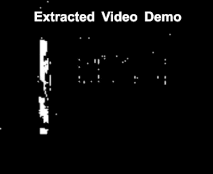
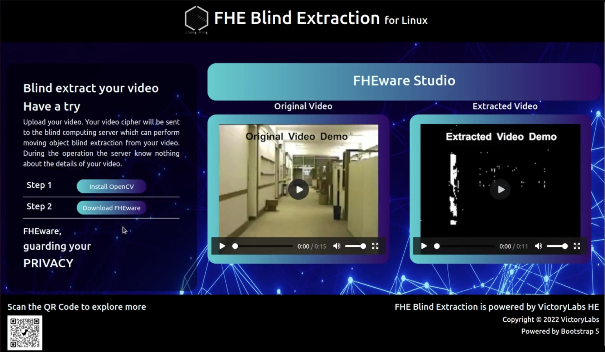
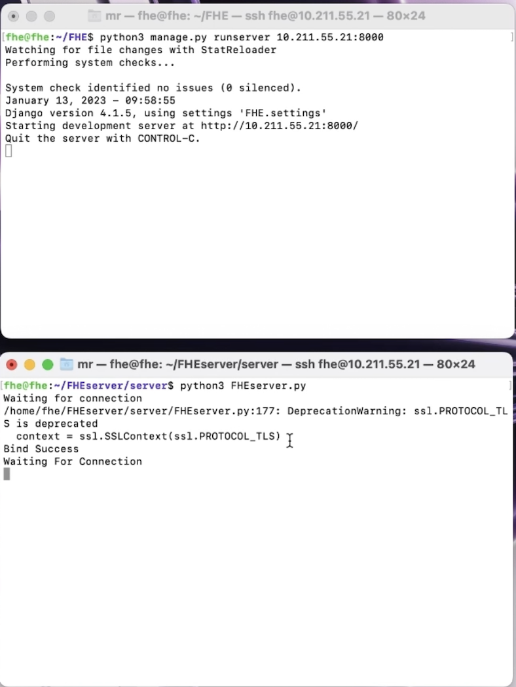
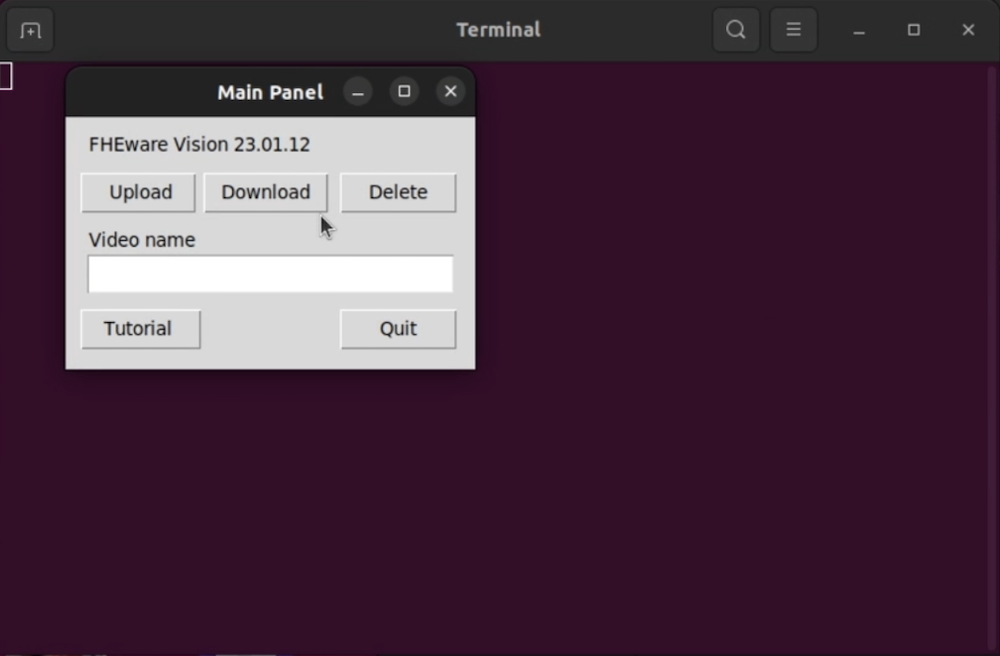

# FHEware

**FHEware** is a self-developed homomorphic encryption algorithm ciphertext video processing system.


This system includes the server **FHEserver** and the client **FHEware**. Based on CMP homomorphic encryption algorithm. 


For more details on CMP homomorphic encryption algorithm you can refer to the website located here:

[https://github.com/BestiVictory/CMP-SWHE](https://github.com/BestiVictory/CMP-SWHE)

### What FHEware can do

Users can encrypt videos which contain privacy and upload them to the server. The server can extract frames with objects in motion and rebuild videos with that. Then users can receive the rebuilt videos without leaking their privacy. 


Moreover, to reduce user disk space usage, files during encryption will be deleted and only necessary files remain. Extracted video ciphers will be stroed in the server side.


Users can request to delete the video ciphers stored in the cloud at any time, and no residual data will be left in the cloud after deletion.

### Installation

For service providers, please git FHEware to */root* and the following command install FHEserver with root priority.

```sh
sh /root/FHEserver/ServerInstall.sh
```

If an error is reported, please accord to ServerInstall.sh and install dependent libs.

### Start blind extracting

Run the following two commands to start web and blind extract program separately.

```python
python3 /root/FHEserver/FHE/manage.py runserver Server_IP:8000

python3 /root/FHEserver/FHEserver/server/FHEserver.py
```

So far all is done, users can visit your website download and install FHEware client and have their videos extracted.

### Demos

Original video and extracted video




Home page of FHEserver



Server command shell



FHEware client GUI



### Attention

Because of the shortage of homomorphic encryption algorithm, FHEware takes up a lot of memory when running.


